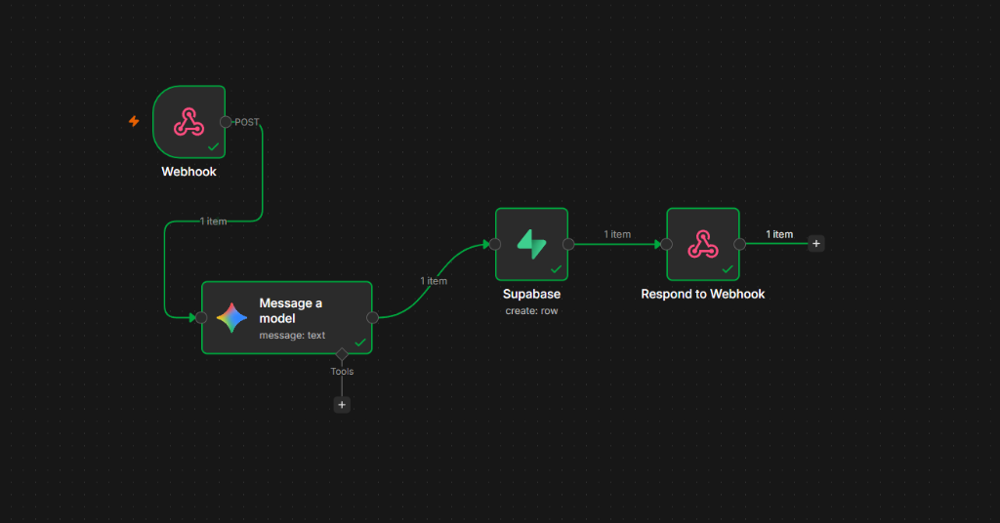

# JobTracker

An automated job application tracking workflow. This repository contains the Chrome extension and automation pipeline architecture used to capture job applications directly from web portals (such as LinkedIn and Greenhouse), process them with AI, and persist them into a database.

---

## 📁 Project Structure

```text
JobTracker/
├── assets/
│   └── n8n-pipeline.png      # Architectural workflow diagram of the n8n pipeline
├── chrome-extension/         # Chrome extension (Manifest V3)
│   ├── manifest.json         # Extension configuration & permissions
│   ├── popup.html            # Popup UI
│   ├── popup.js              # Popup logic & n8n webhook dispatcher
│   └── content.js            # DOM scraper & universal fallback extractor
├── n8n-job-pipeline.json     # Exported n8n workflow definition
├── .gitignore
└── README.md
```

---

## 🔄 Automated n8n Pipeline

Below is the current visual flow of the automated backend pipeline built in **n8n**:



### Pipeline Flow:
1. **Webhook (`POST /webhook-test/log-job`)**: Receives the job payload (`title`, `company`, `url`, `description`, `savedAt`) dispatched from the Chrome extension.
2. **Message a model (Gemini AI Parsing)**: Analyzes the captured job description with `models/gemini-2.5-flash` to generate a 1-sentence role summary and extract the top 3 technical requirements.
3. **Supabase (`create: row`)**: Inserts the parsed job details, company name, application status (`Applied`), and AI notes into the `job_applications` table.
4. **Respond to Webhook**: Sends a JSON response (`{"status": "success", "message": "Application logged successfully"}`) back to the Chrome extension popup.

### Importing the Workflow into n8n:
You can import the complete workflow directly into your n8n instance:
1. Open n8n.
2. Go to **Workflows** > **Import from File**.
3. Select [`n8n-job-pipeline.json`](n8n-job-pipeline.json).
4. Connect your own Supabase and Google Gemini credentials.

> [!NOTE]
> **Project Evolution & Future Changes**:  
> This setup represents the **initial prototype and baseline architecture** of what has been implemented so far. It is designed to be iteratively refined and may change or expand in future iterations. Planned future considerations include:
> - Resume match-scoring and AI-tailored cover letter drafts.
> - Multi-stage application status tracking (Applied, Interviewing, Offered, Rejected).
> - Automated follow-up reminders and calendar integrations.
> - Direct integration with additional platforms and dashboards.

---

## 🚀 Getting Started with the Chrome Extension

### 1. Load Extension in Chrome
1. Open Google Chrome and navigate to `chrome://extensions/`.
2. Toggle **Developer mode** in the top-right corner.
3. Click **Load unpacked**.
4. Select the `chrome-extension` directory inside this repository (`JobTracker/chrome-extension`).

### 2. Configure Endpoint
By default, the extension dispatches job payloads to your local n8n automation pipeline:
```text
http://localhost:5678/webhook-test/log-job
```
To adjust this endpoint, update `API_URL` in [popup.js](chrome-extension/popup.js).

### 3. Usage
1. Open any job listing on **LinkedIn**, **Greenhouse**, or any job board.
2. Click the **Job Application Tracker** extension icon from the toolbar.
3. Verify or edit the extracted **Job Title** and **Company Name**.
4. Click **Save to Pipeline** to dispatch the application details and job description to your n8n workflow.
